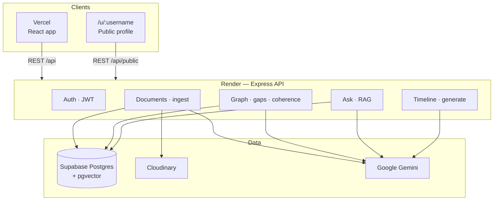

<div align="center">

# Helix

### AI-Powered Digital Identity System

**Your growth, connected — not a pile of files.**

<br />


<br />

[Repository](https://github.com/neshandrag/h.e.l.i.x) · [Live app](https://h-e-l-i-x-peach.vercel.app/) · [Architecture](docs/ARCHITECTURE.md) · [Thought process](docs/THOUGHT_PROCESS.md) · [Proposal](plan.md)

</div>

---

## Overview

Every student builds a digital footprint — certificates, resumes, projects, internship letters, GitHub repos, achievements. They scatter across folders and drives. Traditional storage keeps the files. It never understands the journey.

**Helix** reads what you upload, classifies it, links skills to projects to internships, and turns that evidence into one connected picture of your growth — searchable in plain language, narrated on a timeline, ready to share.

---

## Features

| Feature | Description |
|:--------|:------------|
| **Document ingest** | Upload PDF / DOCX / images (OCR). Optional GitHub repo import and Telegram capture |
| **AI classification** | Auto-sorts into Projects, Skills, Certifications, Internships, Achievements, Academics |
| **Dual scoring** | Classification confidence + rule-based verifiability on every document |
| **Relationship graph** | Certification → Skill → Project → Internship → Career Path, with depth tiers |
| **Coverage gaps** | Surfaces exposure-only skills and what evidence would deepen them |
| **Path coherence** | Qualitative check of whether your documented path forms a consistent story |
| **Journey timeline** | Auto milestones by date; one-click resume bullet or LinkedIn post |
| **Ask your identity** | Natural-language Q&A grounded in vector search + graph evidence (RAG) |
| **Public profile** | Claim a username and share a read-only identity page |

---

## Tech Stack

<table>
<tr>
<th width="50%">Frontend</th>
<th width="50%">Backend</th>
</tr>
<tr>
<td valign="top">

| Layer | Technology |
|:------|:-----------|
| Framework | React 19 |
| Build | Vite 8 |
| Routing | React Router 7 |
| Styling | Tailwind CSS 4 |
| Animation | Framer Motion |
| Graph UI | React Flow + Dagre |
| HTTP | Axios |

</td>
<td valign="top">

| Layer | Technology |
|:------|:-----------|
| Runtime | Node.js 18+ |
| Server | Express 4 |
| ORM | Prisma 6 |
| Database | PostgreSQL + pgvector (Supabase) |
| LLM + embeddings | Google Gemini |
| File storage | Cloudinary |
| Auth | JWT + bcrypt |

</td>
</tr>
</table>

---

## Architecture



| Principle | Detail |
|:----------|:-------|
| **Evidence first** | LLM extracts facts; depth scores are deterministic arithmetic over evidence |
| **Separate concerns** | Classification, verifiability, depth, and coherence never collapse into one opaque score |
| **Grounded answers** | Ask uses retrieval + graph context — no invented documents |
| **Decay** | Relationship weights and recency multipliers fade without fresh evidence |

Full diagrams: [`docs/ARCHITECTURE.md`](docs/ARCHITECTURE.md) · Design rationale: [`docs/THOUGHT_PROCESS.md`](docs/THOUGHT_PROCESS.md)

---

## Screens

| Route | Purpose |
|:------|:--------|
| `/` | Landing |
| `/login` · `/register` | Auth |
| `/dashboard` | Documents — upload, connect GitHub, scores, reclassify |
| `/graph` | Relationship graph, path coherence, coverage gaps |
| `/timeline` | Digital journey + generate resume / LinkedIn copy |
| `/ask` | Natural-language identity Q&A |
| `/u/:username` | Public read-only profile |

---

## Live deployment

Helix uses **Vercel** (frontend) + **Render** (backend) + **Supabase** (Postgres / pgvector). Free-tier friendly.

| Service | Host | URL |
|:--------|:-----|:----|
| Frontend | [Vercel](https://vercel.com) | [h-e-l-i-x-peach.vercel.app](https://h-e-l-i-x-peach.vercel.app/) |
| Backend | [Render](https://render.com) | `https://helix-api.onrender.com` |
| Database | [Supabase](https://supabase.com) | Postgres + `pgvector` |

| Host | Variable | Example | Purpose |
|:-----|:---------|:--------|:--------|
| Vercel | `VITE_API_URL` | `https://helix-api.onrender.com/api` | API base at build time |
| Render | `CLIENT_ORIGIN` | `https://h-e-l-i-x-peach.vercel.app` | CORS (exact origin, no trailing slash) |
| Render | `DATABASE_URL` | `postgresql://…` | Supabase connection |
| Render | `JWT_SECRET` | long random string | Auth tokens |
| Render | `GEMINI_API_KEY` | — | Classification, embeddings, generation |
| Render | `GEMINI_MODEL` | `gemini-flash-lite-latest` | Preferred free-tier model |
| Render | `CLOUDINARY_*` | — | Original file storage |

**Note:** Render free services sleep when idle — the first API request after a pause can take ~30–60s.

### Render service settings

| Field | Value |
|:------|:------|
| Root directory | `helix/server` |
| Build | `npm install` |
| Start | `npx prisma generate && npx prisma db push && npm start` |

### Vercel project settings

| Field | Value |
|:------|:------|
| Root directory | `helix/client` |
| Framework | Vite |
| Build | `npm run build` |
| Output | `dist` |
| Env | `VITE_API_URL=https://helix-api.onrender.com/api` |

---

## Quick start (local)

**Requirements:** Node.js 18+ · PostgreSQL with `pgvector` (or Supabase)

```bash
# Terminal 1 — Backend
cd helix/server
npm install
cp .env.example .env      # DATABASE_URL, GEMINI_API_KEY, CLOUDINARY_*, JWT_SECRET
npx prisma db push
# enable pgvector once (see helix/server/prisma/sql/enable_vector.sql)
npm run dev               # http://localhost:5000

# Terminal 2 — Frontend
cd helix/client
npm install
cp .env.example .env      # VITE_API_URL=http://localhost:5000/api
npm run dev               # http://localhost:5173
```

| Service | URL |
|:--------|:----|
| App | http://localhost:5173 |
| API | http://localhost:5000 |
| Health | http://localhost:5000/api/health |

---

## Configuration

### Server (`helix/server/.env`)

| Variable | Required | Default | Description |
|:---------|:--------:|:--------|:------------|
| `DATABASE_URL` | Yes | — | Postgres connection string |
| `JWT_SECRET` | Yes | — | Signing key for auth tokens |
| `JWT_EXPIRES_IN` | No | `7d` | Token lifetime |
| `GEMINI_API_KEY` | Yes | — | Google AI Studio key |
| `GEMINI_MODEL` | No | flash aliases | Override generation model |
| `CLIENT_ORIGIN` | Yes* | `http://localhost:5173` | CORS origin(s), comma-separated |
| `CLOUDINARY_CLOUD_NAME` | Yes* | — | File uploads |
| `CLOUDINARY_API_KEY` | Yes* | — | File uploads |
| `CLOUDINARY_API_SECRET` | Yes* | — | File uploads |
| `GITHUB_TOKEN` | No | — | Higher GitHub API rate limit |
| `TELEGRAM_BOT_TOKEN` | No | — | Optional Telegram ingest |
| `PORT` | No | `5000` | API port |

\* Required for full upload flow in production.

### Client (`helix/client/.env`)

| Variable | Required | Default | Description |
|:---------|:--------:|:--------|:------------|
| `VITE_API_URL` | Yes* | `http://localhost:5000/api` | Backend API base URL |

\* Required on Vercel — must point at Render (`https://helix-api.onrender.com/api`).

---

## Project structure

```
memo/
├── helix/
│   ├── client/                 React + Vite frontend
│   │   ├── public/             Favicon · redirects for SPA
│   │   └── src/
│   │       ├── pages/          Landing · Dashboard · Graph · Timeline · Ask · Public
│   │       ├── components/     Header · cards · graph · modals
│   │       ├── context/        Auth
│   │       └── lib/            Axios API client
│   └── server/                 Express + Prisma API
│       ├── prisma/             Schema · SQL (pgvector)
│       └── src/
│           ├── controllers/    Auth · documents · graph · timeline · public
│           ├── services/       AI · scoring · GitHub · RAG · narrative
│           └── routes/         /api/*
├── docs/
│   ├── ARCHITECTURE.md         System diagram · modules
│   └── THOUGHT_PROCESS.md      Decisions · trade-offs
├── plan.md                     Original technical proposal
└── README.md                   This file
```

---

## Modules (brief)

| Module | What it does |
|:------:|:-------------|
| **1** | Ingest — upload, GitHub, optional Telegram / email |
| **2** | Categorize — schema-validated Gemini classification + verifiability |
| **3** | Relate — typed graph, depth tiers, gaps, coherence |
| **4** | Narrate — timeline milestones + reusable content generation |
| **5** | Retrieve — embeddings, semantic search, advisory RAG answers |

---

## Documentation

| Document | Contents |
|:---------|:---------|
| [docs/ARCHITECTURE.md](docs/ARCHITECTURE.md) | Layers, data flow, module design |
| [docs/THOUGHT_PROCESS.md](docs/THOUGHT_PROCESS.md) | Why scoring and AI are separated |
| [plan.md](plan.md) | Full technical proposal |
| [helix/server/README.md](helix/server/README.md) | API / server notes |
| [helix/client/README.md](helix/client/README.md) | Frontend notes |

**Last updated:** July 2026

---

<div align="center">

**Upload once. Watch your identity connect itself.**

<br />

[github.com/neshandrag/h.e.l.i.x](https://github.com/neshandrag/h.e.l.i.x) · [h-e-l-i-x-peach.vercel.app](https://h-e-l-i-x-peach.vercel.app/)

</div>
