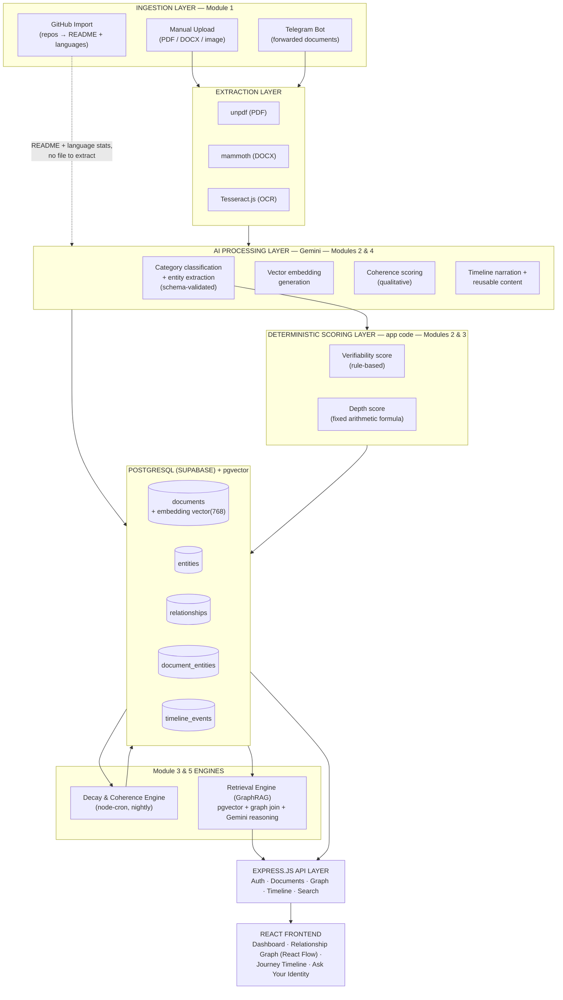

# Helix — Architecture

This document is the AI workflow / architecture diagram deliverable. It covers system layers, data flow, the data model, and per-module technical design. It is derived from `plan.md` Sections 6, 8, and 9, kept in sync with what's actually implemented (see the status column in the root `README.md`).

## System diagram



## Module-level design

### Module 1 — AI Data Ingestion
Three channels feed the same downstream pipeline:
- **Manual upload** — `multipart/form-data` via Multer, buffer piped to both text extraction and Cloudinary in parallel.
- **Telegram bot** (`telegram.service.js`) — long-polling Telegraf bot. A user links a chat to their Helix account with a one-time code (`POST /api/auth/telegram/link-code`, redeemed via `/link <code>` in Telegram); any document or photo sent afterward is downloaded and run through the identical ingestion path with `sourceChannel: TELEGRAM`.
- **GitHub import** (`github.service.js`) — given a username, fetches the most recently updated non-fork public repos via Octokit, combines each repo's description, language breakdown, and README into a text blob, and ingests it as evidence with `sourceChannel: GITHUB`. Works against GitHub's public API unauthenticated (60 req/hr); an optional `GITHUB_TOKEN` raises that to 5000 req/hr.

All three funnel into `document.service.js`'s `ingestExtractedContent()` — the single function responsible for classification → scoring → embedding → entity linking, regardless of where the text came from.

### Module 2 — Intelligent Categorization
- Gemini call with `responseSchema` constrains output shape at generation time; the JSON is then re-validated with Zod before anything trusts it.
- One retry on malformed output; second failure degrades to `category: "Uncategorized"`, `confidence: 0`, `needsReview: true` — **the upload never fails because the model misbehaved.**
- **Verifiability score** is rule-based, not model-judged: checks issuer domain patterns (`.edu`, `coursera`, `linkedin`, etc.) and presence of a verification link/credential ID in the extracted text.

### Module 3 — Relationship Engine (Knowledge Graph)
- Entities (`Skill`, `Project`, `Certification`, `Internship`, `Achievement`) are graph nodes; typed edges (`CERTIFIES`, `APPLIES_TO`, `LED_TO`) connect them per the rules in `relationship.service.js`.
- **Depth score is arithmetic, not an AI opinion:**

  ```
  points(evidence)   = 1 (Certification) | 2 (Project) | 3 (Internship)
  recency_multiplier = 1.00 (<12mo) | 0.50 (12–24mo) | 0.25 (>24mo)
  depth_score(entity) = Σ points × recency_multiplier, over all linked evidence

  tier: <2 → Exposure · 2–5 → Working Knowledge · ≥5 → Demonstrated Mastery
  ```

- **Temporal decay** — a nightly `node-cron` job (`jobs/decayJob.js`) recomputes edge weight from `lastReinforcedAt` and refreshes every entity's depth score, so stale skills visibly fade rather than staying permanently "mastered."
- **Gap detection** — `GET /api/graph/gaps` surfaces entities stuck at the `EXPOSURE` tier: real evidence exists, but not enough of it.
- **Coherence scoring** (`coherence.service.js`, `GET /api/graph/coherence`) — a separate, explicitly qualitative Gemini pass over the user's full chronological document history, judging whether the path is a consistent progression and naming specific discontinuities. Kept fully independent of the deterministic depth-score formula above by design — one LLM opinion is never allowed to silently affect another module's number.

### Module 4 — Digital Journey Timeline
Timeline events are user-materialized from a document (`POST /api/timeline`); `narrative.service.js` generates the one-sentence milestone description and, on demand, a resume bullet or LinkedIn post from that same text. Narrative output is presentational only — it never feeds into scoring.

### Module 5 — Smart Retrieval System (Semantic Search + RAG)
- **Standard path** (`POST /api/search`) — query text is embedded and matched against `documents.embedding` via pgvector's `<=>` cosine-distance operator, ranked, returned with direct links to originals.
- **Advisory path / GraphRAG** (`POST /api/search/ask`) — combines the top vector-search hits with the full entity/depth-score graph, hands both to Gemini as context, and asks it to answer evidence-based ("here's what you have, here's the gap") rather than just listing documents.

## Data model

See `helix/server/prisma/schema.prisma` for the authoritative definitions (`User`, `Document`, `Entity`, `DocumentEntity`, `Relationship`, `TimelineEvent`). `depthScore`/`depthTier` on `Entity` and `weight` on `Relationship` are both derived columns, recomputed from `document_entities` — any reviewer can re-derive them from the raw evidence rows using the formula above, rather than trusting an opaque stored number.

## Live deployment

| Layer | Host | URL |
|:------|:-----|:----|
| Frontend | Vercel | https://h-e-l-i-x-peach.vercel.app |
| API | Render | https://h-e-l-i-x-r2po.onrender.com |
| Database | Supabase | Postgres + pgvector |

Production env: Vercel `VITE_API_URL=https://h-e-l-i-x-r2po.onrender.com/api` · Render `CLIENT_ORIGIN=https://h-e-l-i-x-peach.vercel.app`. Full deploy notes: root [`README.md`](../README.md#live-deployment).
